---
title: Course Registration Browser Extension
---   

<head>
    <link rel="stylesheet" href="css/help.css">
</head>

**[Code](https://github.com/TroyNech/CP476-BrowserExtension)**

<body>
    <h1>LaurierLinks User Guide</h1>
    

    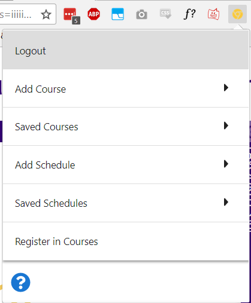
    <h1>Login/Register</h1>
    
All functionality is disabled until the user logs in.

    <h2>Login</h2>
    
Enter a previously registered email with corresponding password, then click Login. If the login is invalid, an alert
        appears. If it is valid, the following happens:

    <ul>
        <li>A success icon will briefly display</li>
        <li>The Login tab will close and transition into a logout button</li>
        <li>The other tabs will be unlocked</li>
    </ul>
    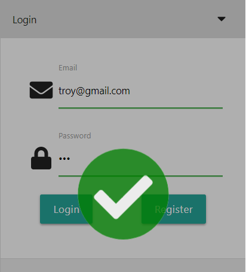
    <h2>Register</h2>
    
To register, enter an email and password, then click Register. Confirm the password in the Confirm Password field that
        appears, then click Register again. An appropriate error message appears if the passwords do not match or if the
        email is already registered. If the registration is successful, an acknowledgement message appears, then the same
        tab actions occur as on a successful login.

    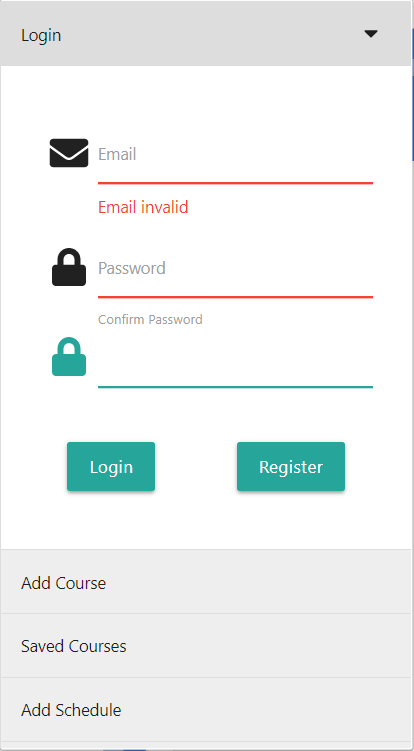
    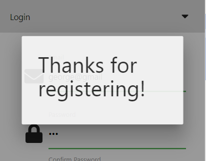
    <h1>Logout</h1>
    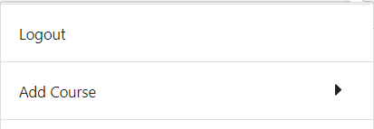
    
Click the logout tab to logout.

    <h1>Add Course</h1>
    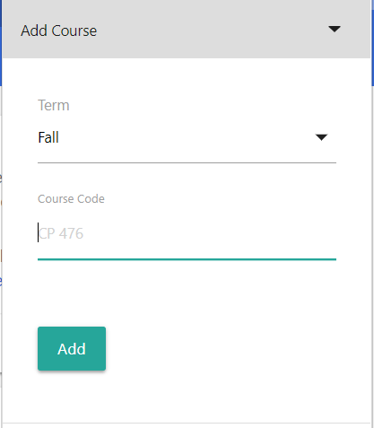
    
Enter the course code and select the term of the course to add. The term is used to determine the start of the course's
        semester. The year of the semester is determined as follows:

    <ul>
        <li>Fall: The current year</li>
        <li>Winter: The next year</li>
        <li>Spring: The year of the current month plus 1</li>
    </ul>
    
An error message appears if the term and course code combination is invalid. If it is valid, a success message appears.

    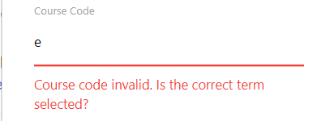
     
     
    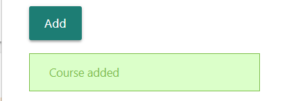
    <h1>Saved Courses</h1>
    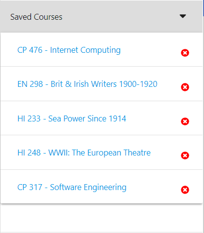
    
Click on a course to add it to the Course Detail page. The page will opened if it is not currently the active tab.

    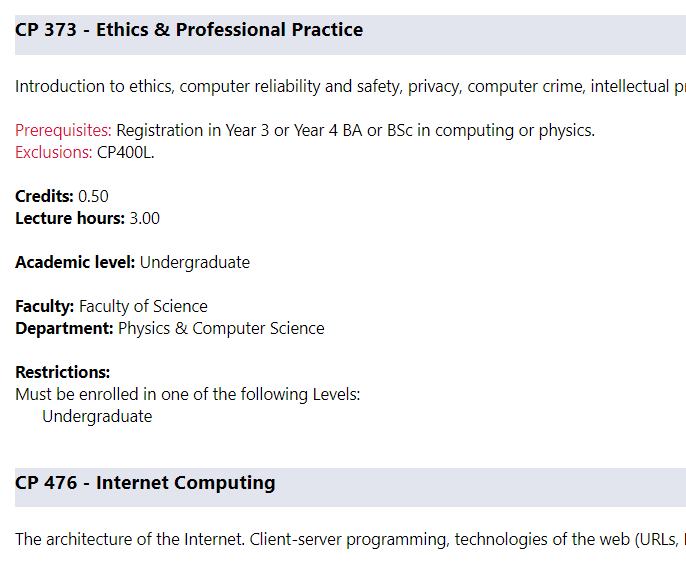
    
Click the Remove Icon to remove a course from the list of saved course. The course will transition out of the popup.

    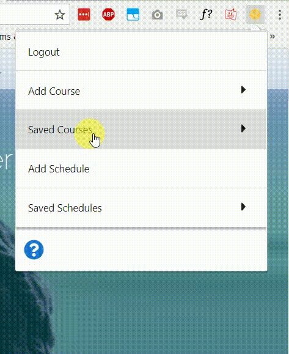
    <h1>Add Schedule</h1>
    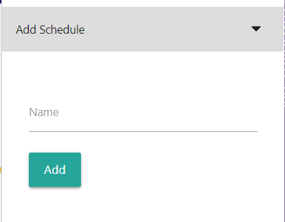
    
The Add Schedule tab allows users to save the active VSB schedule.

    
If the VSB is not open on the current tab, the Add Schedule tab acts as a button that redirects to the VSB.

    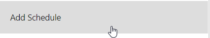
    

        <em>VSB:
            <a href="https://scheduleme.wlu.ca/vsb" target="_blank">https://scheduleme.wlu.ca/vsb</a>
        </em>
    

    
A success message appears when a schedule is added, like when a course is added.

    <h1>Saved Schedules</h1>
    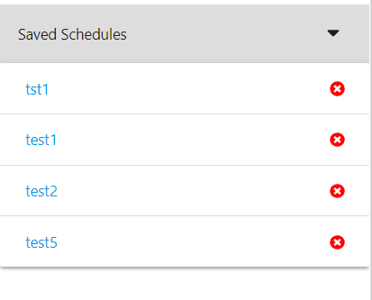
    
Click a schedule to open the corresponing VSB page.

    
Click the Remove Icon to remove a schedule from the list. The schedule will transition out of the popup, like when a
        course is removed.

    <h1>Register Courses</h1>
    
This tab is only available on the VSB page. When clicked, the extension takes the CRNs of the courses currently on the
        VSB page and autofills them into LORIS' Registration page.

    
The user is prompted to enter their LORIS credentials. The extension then attempts to login and navigate through LORIS
        to the Registration page, on which it will autofill the CRNs from the VSB page. It is left to the user to finish
        the registration process by clicking Submit.

    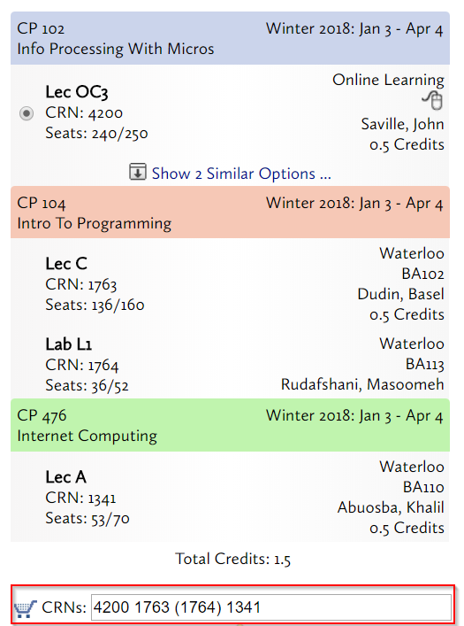
     
     
    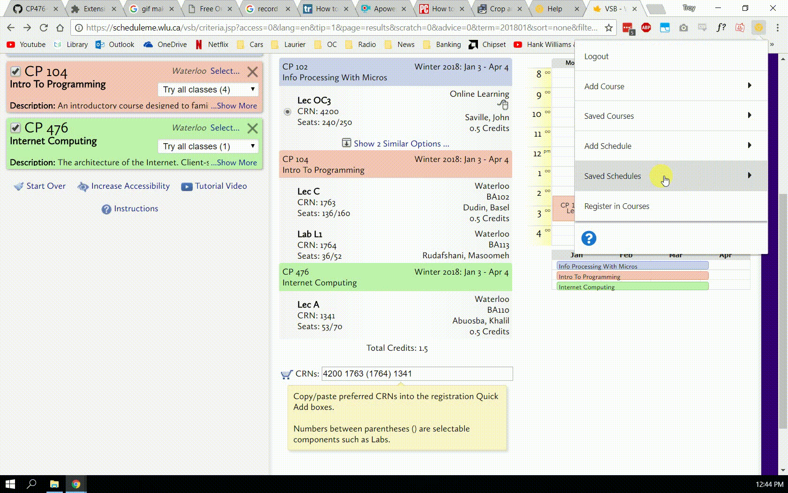
    <h1>Help</h1>
    
Click the Help icon at the bottom of the popup window to open the Help page (this page).

    <h1>Install Instructions</h1>
    <ul>
        <li>Download the .zip file from
            <a href="https://github.com/TroyNech/CP476-BrowserExtension/blob/prod/extension.zip" target="_blank">https://github.com/TroyNech/CP476-BrowserExtension/blob/prod/extension.zip</a>
            <ul>
                <li>
                    <em>Note: The unzipped folder has been provided in the project submission</em>
                </li>
            </ul>
        </li>
        <li>Unzip the file into the desired install directory</li>
        <li>In Chrome, open
            <a href="chrome://extensions/" target="_blank">chrome://extensions/</a>
        </li>
        <li>Enable Developer Mode</li>
        <li>Click Load Unpacked and select the extension folder</li>
        <li>Disable Developer Mode</li>
        <li>Done!</li>
    </ul>
</body>