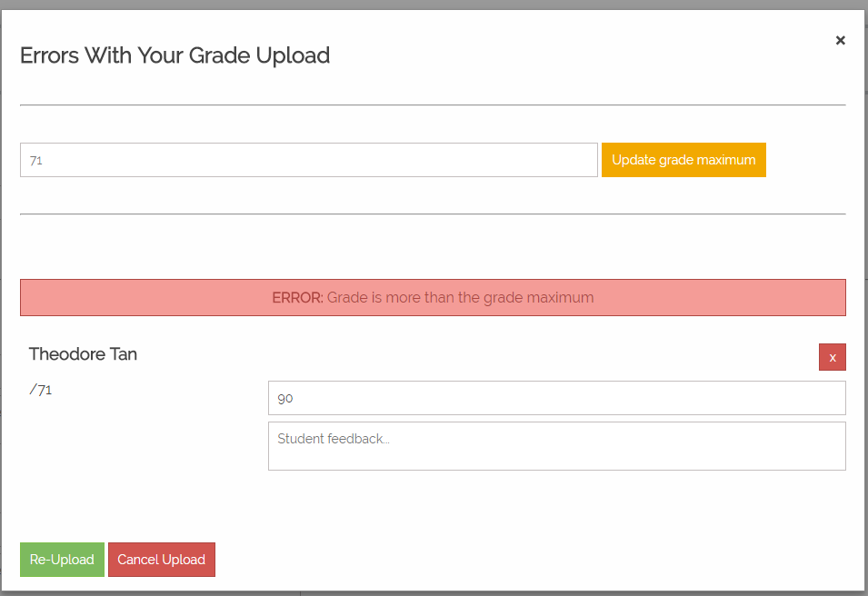

**[PHP Code](https://github.com/TroyNech/CP317_MLS_Project/tree/php)**
**[Python Code](https://github.com/TroyNech/CP317_MLS_Project/tree/python)**

*Note: Some of the content in this document was written by other students who worked on the project*

<body>
    <h2>Introduction</h2>
    

        ezMarker is a web application that allows instructors at Wilfrid Laurier University to bulk upload grades and feedback into <a href="https://mylearningspace.wlu.ca" target="_blank"><b>MyLearningSpace (MLS)</b></a>, with the integration of the Brightspace API supported by D2L. The goal of ezMarker is to solve the issues regarding inefficient manual grade uploading through the current MyLearningSpace interface. On average, it can take markers a few hours to manually upload grades for one class. Marking time is cut down to minutes with the use of ezMarker's bulk file uploading.

    <h2>General Homepage</h2>
    

        If the user is not already logged in:

    <ul>
        <li>
            Courses, username and logout button will be hidden</li>
    </ul>
    <ul>
        <li>
            The user will be given an option to select either Docs or Login</li>
    </ul>
    
    <h3>Documents Page</h3>
    

        If Docs is selected, the user will be sent to the documents page.

    
    <h3>Login Page</h3>
    

        If Login is selected, the user will be sent to the Login page. In order to login, the user
        needs to have MyLearningSpace credentials.

    
    

        If login is unsuccessful, the user is be shown an error message, and needs to retry.

    
    <h3>Accessing the Homepage</h3>
    

        The user can always access the ezMarker homepage by clicking on the ezMarker logo on the
        Navigation Bar.

    

    <h2>User Homepage</h2>
    

        Once the user is logged in they will have access to the Courses and Help page as well as the
        option to logout.

    <h3>Navigation Bar</h3>
    

        The user can select between Courses or Help on the navigation bar. 

    <ul>
        <li>
            If Courses is selected, the user will be taken to the Course List page with a list of course
            grade items.</li>
    </ul>
    <ul>
        <li>
            If Help is selected, the user will be taken to the Help page for step by step instructions on
            how to navigate the ezMarker website.</li>
    </ul>
    
    

        The user will also be shown their name and the option to logout.

    
    
<strong>Note: </strong>

    <ul>
        <li>
            <strong>Logging out will not redirect the user to ezMarker. Instead the user will be directed
                to the Brightspace instance.</strong></li>
    </ul>

    <h2>Course List Page</h2>
    

        Upon login or selection, the user is taken to the Courses page where the user can select a
        Grade Item to update or review.

    
    

        To modify a specific course, the user can select that course and expand it to show the
        course's individual grade items. If a grade item is clicked the user will be taken to the
        Grade Item page.

    

    <h2>Grade Item page</h2>
    

        Once the user selects a grade item, they are redirected to the grade item page. This page
        allows the user to:

    <ul>
        <li>
            Change Grade Maximum: Give user the ability to change the max grade limit</li>
    </ul>
    <ul>
        <li>
            Automated Upload: Give user the ability to upload an Autograder file</li>
    </ul>
    <ul>
        <li>
            Manual Grade Input: Give user the ability to update student grades manually</li>
    </ul>
    

    <h3> Change Maximum Grade</h3>
    

        The user can update the grade item's maximum grade value by entering a positive number and
        submitting the form with Update Grade Maximum button. The user can also use the Enter key to
        submit Grade Maximum update.
    

    
    <h4>Confirm update </h4>
    

        When the user submits the form, a message appears to confirm the user wants to proceed.

    
    <h4>Successful update </h4>
    

        If the user confirms and they submit a valid grade maximum, a success message will appear and
        the UI will be updated appropriately.

    
    <h4>Invalid update </h4>
    

        If an invalid grade maximum is given, an error message will appear and the user will have to
        check their input.

    

    <h3> Automated Upload </h3>
    

        The user is prompted to choose a file to upload that follows the Autograder file format of
        <strong>brightspace_id, grade, name, comment</strong>.
    

    
    <h4>Upload successful</h4>
    

        If the file is valid and grades are uploaded through the Brightspace API, the user is brought
        to the report page.
    

    
Note:

    <ul>
        <li>
            The comment for student feedback is not required.</li>
    </ul>
    
    

    <h4>Upload error</h4>
    

        If the file is invalid an error message will be shown. There are cases where the file is
        valid but if the marks are invalid, a pop-up will appear to give the user a chance to correct
        the errors and re-submit.

    

    <h3> Manual Grade Input</h3>

    

        The user can also upload grades manually.

    

    <h4>Adding students</h4>
    

        Students can be added in 3 ways:

    <ul>
        <li>
            Search for a student using their name</li>
    </ul>
    
    <ul>
        <li>
            Search for a student using their ID</li>
    </ul>
    
    <ul>
        <li>
            Select all option will quickly add input boxes for all students</li>
    </ul>
    
    <h4>Removing students</h4>
    

        Once a student is added, they can be removed by hitting the X- button beside their name. A message in red will
        appear indicating which student was removed. 

    

    <h4>Grade input successful</h4>
    

        Grade input is required and must be a positive number. Some grade items allow for the grade to
        exceed the maximum grade value, while others do not.
    

    
Note:

    <ul>
        <li>The comment for student feedback is not required.</li>
    </ul>

    <h4>Grade input error</h4>
    

        If there are any errors with the user's upload, a pop-up will appear with an appropriate
        warning or error message. The user must fix these issues and re-submit to successfully upload
        student grade, otherwise cancel their upload. If the grade item does not allow inputted
        grades to be greater than the maxamum grade value, an error message will appear if the
        inputted grade exceed the max value. In this case, the user is forced to input a grade less
        than or equal to the maximum grade value.
    

    
    <h4>Grade input warning</h4>
    

        A warning message saying the inputted grade exceeds the grade item's maximum grade value may
        be ignored. The UI is just confirming
        with the user that this was their intention.

    

    <h2>Report Page</h2>
    

        The report page shows a summary of the user's upload. It shows how many grades were
        successfully set by the Brightspace API, any errors from the API, and a summary of the
        students that had their grades changed.
    

    

    <h2>Logout Page</h2>
    

        The user can logout (end their MLS session) by pressing the logout button of the navigation
        bar. 

    

    
<strong>Note: </strong>

    <ul>
        <li>
            <strong>Logging out will not redirect the user to ezMarker. Instead the user will be directed
                to the Brightspace instance.</strong></li>
    </ul>

</body>

