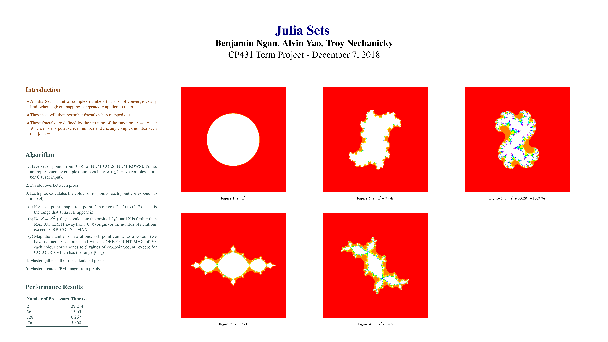

This is my term-project for parallel programming course done in C using the MPI parallel programming library. It was fun to do, although I did have some trouble saving the image to a file and figuring out a colour scheme!

**[Code](https://github.com/TroyNech/CP431/tree/master/term_project)**

## Project Poster

